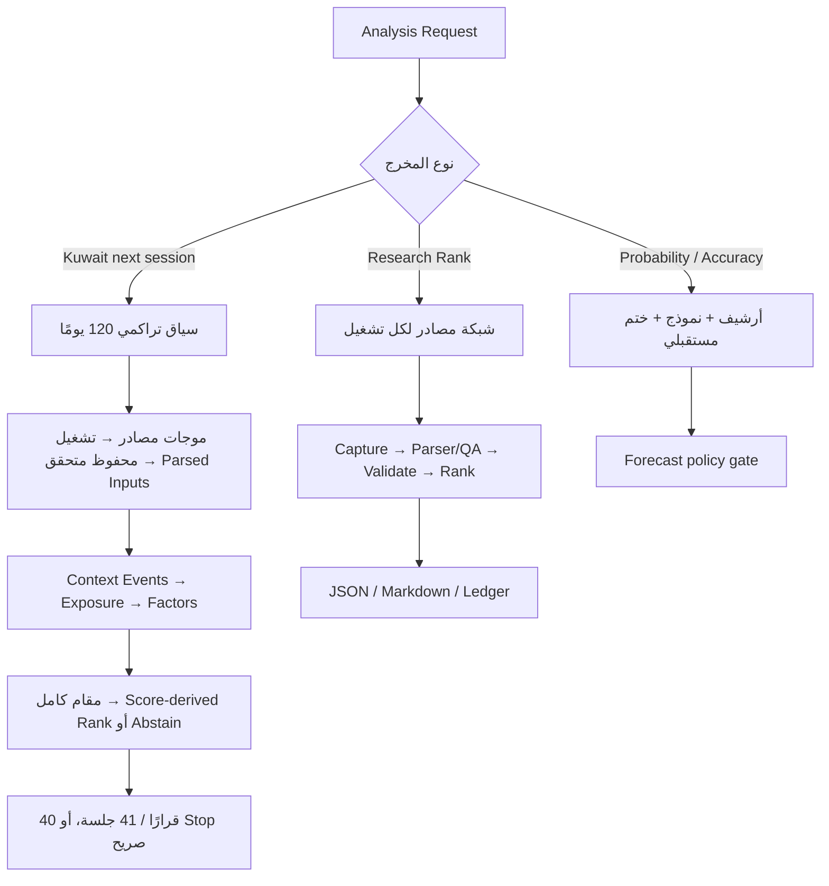

# معمارية الأساس البرمجي KU-BO 0.1.0

هذه المعمارية تصف أساسًا قابلًا للتدقيق واختبار العقود، لا منصة Production مكتملة أوخدمة بيانات حية مضمونة التوافر.

## المساران

`research_network` هو المسار الافتراضي. يعتمد على دليل حديث متعدد المصادر ويعمل من دون أرشيف كامل أو نموذج. المنتج `KUWAIT_120D_NEXT_SESSION_RESEARCH` يضيف سياقًا تراكميًا وعقد مقام كامل، لكنه يظل Research Score غير مُحقق مستقبليًا. `validated_forecast` هو مسار V2 الصارم؛ لا يسمح باحتمال أو ادعاء أداء إلا عند استيفاء Pack وModel Card والتحقق المستقبلي.

## مكونات مسار الشبكة

- `SourceNetworkCatalog`: يقرأ 68 تعريف مصدر و62 مجموعة استقلال وسياسات الأفق، ويتحقق من الأدوار والنطاقات والاستقلال وحدود التوقيت. يوجد 59 نطاقًا مرشحًا بعد استبعاد البحث والتخزين، و53 نطاقًا معلنًا Enabled-public، و52 نطاق Start URL تنفيذيًا مميزًا قبل الحجز. العدد لا يساوي تأكيدات مستقلة.
- `ingestion` و`capture_plan`: يجمعان البايتات العامة أوUser exports بصورة محدودة، ويحفظان Raw وManifest دون ترقيتها تلقائيًا إلى Finding. خطة واحدة لا تتجاوز 32 مهمة أو128 MiB أو300 ثانية إجمالًا، ويحدث رفض التجاوز قبل Connector/I/O.
- `Parser/QA`: يحتوي محلل هوية Boursa ومحلل تاريخ سعر Investing فقط، مع مصالحة ISIN واختبارات Drift ونهاية إلى نهاية على Fixtures مولدة. مصفوفة `source_capabilities.json` تفصل `END_TO_END_TESTED` عن `LIVE_OPERATIONAL`؛ ولا توجد في المستودع Fixture حية مصرح بها ترفع أي مصدر إلى الحالة الثانية.
- `RuntimeTrustRegistry`: يصادق سجلًا خارجيًا بـ`HMAC-SHA256` ومفتاح Runtime، ويتحقق من الجمهور والصلاحية ويربط المصادر الحساسة بالحساب/Subject والنطاق وSecurity codes وActivation/Entitlement.
- `SourceNetworkRunValidator`: يتحقق من عقد التشغيل، وهوية Effective-dated إلزامية لكل Scope، والأثر الخام، وManifest، ومحاولات المصادر، و`fact_type`، وتطابق Finding URL مع Artifact URL، والتوقيت، والـQuorum.
- `rank_research_candidates`: يجمع الإشارات بعد Dedup، ويطبق سقف ثقة فئة المصدر وسقف المزاج، ويرصد التعارض.
- `analysts` و`liquidity`: ينتجان إشارات وصفية شفافة ويقيسان Tradability؛ لا ينتجان Probability.
- `ResearchPipeline`: يحول نتيجة التحقق إلى `RESEARCH_READY` أو حالة توقف/نقص، ثم يعيد مرشحين بحدود الادعاء.
- `request_contracts` و`reporting`: يطابقان Scope ونوع التقرير واللغة والعمق، ويرفضان Claims غير مسموحة.
- `research_ledger`: يجمد Decision وOutcome في streamين منفصلين مع Hash chain وSeal؛ ويربط Outcome بحزمة Raw داخل Ledger يعاد التحقق منها عند القراءة والختم، لا بـHash يقدمه المتصل.
- `cli_v3`: يوفر أوامر الجمع والتحقق والتخطيط والتقرير والسجل.

## طبقات `KUWAIT_120D_NEXT_SESSION_RESEARCH`

- `research_workflow`: يثبت النوافذ 120 يومًا/30 يومًا/7 أيام/72 ساعة، ترتيب الموجات، ميزانيات المحاولة، وعقد الإعادة التاريخية.
- `source_orchestrator`: ينفذ موجات bounded. الخطة الافتراضية العادلة تختار 50 نطاقًا بمساهمات جديدة `17/0/29/4`، وتحجز الموجة الأخيرة لـ`archive.org` و`commoncrawl.org` و`indexsignal.com` و`t.me`؛ أسطح Investing/TradingView المجتمعية لا تضيف نطاقًا جديدًا بعد احتسابهما في الموجة الثالثة. `web_search_router` يبقى Catalog-only ولا ينفذ.
- persisted Source Search validator: يعيد فتح التقرير وسجل المحاولات والـRaw artifacts، ويعيد حساب بصماتها ويرفض العبث أوالمسار غير الآمن قبل قبول أي طبقة تالية.
- Attempt ledger: يسجل كل محاولة و`Retry-After` والـDisposition والقيود في Hash chain، مع Non-claims صريحة بأن السلسلة ليست External Seal، وCapture time ليست Publication time، وLow-level HTTP requests ليست كلها Metered، وParser cutoff وMaterial zero-result proofs ما زالا إلزاميين. المنع الصريح لا يعاد، و429 يتوقف بعد ثلاث محاولات في الاستراتيجية نفسها، وتوقف ميزانية الوقت أوSleeper failure المسار Fail-stop.
- `context_research`: يطبّع الحدث ونطاقه، يزيل التكرار، ويربطه بالورقة عبر Exposure موثق مع التعارض وعدم الحسم.
- `kuwait_research_pipeline`: جسر Fail-closed من Source Search المتحقق إلى `parsed-research-inputs` ثم Context/Exposure/Factor artifacts ذرية. لا يحتوي Parser عامًا ولا يستنتج قيمًا أوScores؛ كل Evidence hash يجب أن يحل إلى Raw artifact أعاد المدقق بصمته.
- Factor registry/snapshot: ينتج حالة `OBSERVED` أو`MISSING` أو`NOT_APPLICABLE` أو`REJECTED` لكل عامل، بلا اختراع قيمة صفرية. تربط `factor_snapshot_sha256` كامل المحتوى القانوني للصفوف والعوامل والأدلة والتصرفات والدرجات ويُشتق `snapshot_id` منها. تُفرض نافذة كل عامل من السجل مقابل `available_at/decision_at`، ومنها 24 ساعة لحالة التداول، ويُمنع الحدث `SUPERSEDED` من Exposure صالح للعوامل.
- Full denominator: ينتج صفًا لكل `security_code` متوقع عند كل Cutoff، بحالة `SELECTED` أو`REJECTED` أو`ABSTAINED` أو`UNRESOLVED` وسبب أول مرحلة فاشلة.
- `forty_session_replay`: المنتج Execution-grade. يعيد اشتقاق Rank من Score تنازليًا وSecurity Code تصاعديًا عند التعادل، ويفرض أن Selected تساوي Top-K وأن كل Selected يحمل Fill ودليل تنفيذ. الـPrimary label هو adjusted gross return قبل التكاليف؛ الرسوم وSpread وSlippage تدخل في Actionable net وMarket/Sector net-excess الثانوية. لا يحسب Metrics إلا من 40 قرارًا و41 جلسة رسمية متتالية مع Universe وFeatures وOutcomes حقيقية Point-in-Time. يبقى Non-trading member في المقام، لكن أي حالة غير متداولة تعيد `STOP_BACKTEST` ما دام `KU-BO-008-D01` مفتوحًا. نتيجة الإيقاف تفرض `metrics=null` و`agreement_rate=null/NOT_APPLICABLE` و`authority_verified=false` و`accuracy_claim_allowed=false`؛ ولا يعلن Runtime حالة `STOP_INFERENCE` غير القابلة للوصول.

الكتالوج لا يساوي طبقة جمع حية: الحالة الحالية 66 `DEFINED_ONLY` و2 `END_TO_END_TESTED` على Fixtures مولدة و0 `LIVE_OPERATIONAL`.

## استقلال المصادر

الاستقلال يُحسب حسب الناشر/الأصل، لا حسب الرابط. صفحات Boursa الحالية والتقارير والإفصاحات تنتمي إلى مجموعة واحدة. كذلك Investing وصفحات تعليقاته مجموعة واحدة، وTradingView وIdeas مجموعة واحدة. المقالات المنسوخة من Reuters تُجمع في أصل واحد. إعادة إرسال رسالة Telegram لا تنشئ مصدرًا ثانيًا.

لا يكفي أن يعلن المصدر أنه أدى دورًا. كل Finding يحمل `evidence_roles`، ويُحسب نصاب الدور لكل ورقة مالية من الناشرين والأصول والأحداث المستقلة المرتبطة فعليًا بهذه Findings. `ZERO_RESULT` لا يملأ Quorum، والنتائج المحايدة أوذات Strength/Materiality صفر لا ترفع Coverage. وعند تأكيد محفز، يجب أن يطابق المصدر الرسمي `event_key` والاتجاه نفسه.

## حدود الحقيقة

- الرسمي/جهة الإصدار: يستطيع تأكيد حدث أو هوية رسمية.
- Structured secondary: يستطيع إنشاء Observation منسوبًا للمزود، لا حقيقة رسمية.
- Editorial: يستطيع إنشاء سياق/خبر منسوبًا للمصدر، مع Dedup للأصل.
- Community: `SENTIMENT` و`RISK` فقط.
- Web archive: `ARCHIVE_CONTEXT` فقط.
- Search/Storage: لا ينشئ Finding.
- Licensed: يمكنه دعم Execution فقط مع Entitlement وتوقيت مثبتين.

## حد الثقة والتفويض

الـPacket كيان غير موثوق حتى يثبت العكس؛ لذلك لا يستطيع إيصال `runtime_authority` أوActivation أوEntitlement داخله أن يكون Root of Trust لنفسه. يفرض `0.1.0` سجل ثقة خارجيًا مهيأ خارج Packet ومصادقًا بـ`HMAC-SHA256` ومفتاح Runtime للمصادر Disabled/Runtime-bound/Licensed، ويربط المصدر بالـSubject/Account والنطاق وSecurity codes وActivation/Entitlement وفترة الصلاحية. غياب السجل أوالمفتاح، أوفشل المصادقة أوعدم وجود قيد فريد مطابق، يحجب المصدر Fail-closed.

## بوابات الفشل

أي Hash غير مطابق، أو Hash تابع لمصدر آخر، أو Artifact جُمع بعد القرار، أو مسار Raw غير آمن، أو مصدر غير مسجل، أو URL خارج النطاق، أو Finding مستقبلي، أو Search Snippet/Access Receipt مستخدم كدليل، أو محاولة ترقية المنتدى إلى Catalyst تجعل الحزمة `BLOCKED`.

نقص نصاب الأدوار يجعلها `PARTIAL`. تعطل مصدر منفرد لا يوقفها إذا اكتمل النصاب من مجموعات مستقلة أخرى **وبقيت هوية Official/Licensed بديلة وحديثة لكل Security مغطى**؛ وإلا يكون فشل الهوية `SOURCE_NETWORK_BLOCKED`.

الـRanker لا يستطيع إزالة Blocking Error، ولا يستطيع توليد Probability أو Recommendation.
