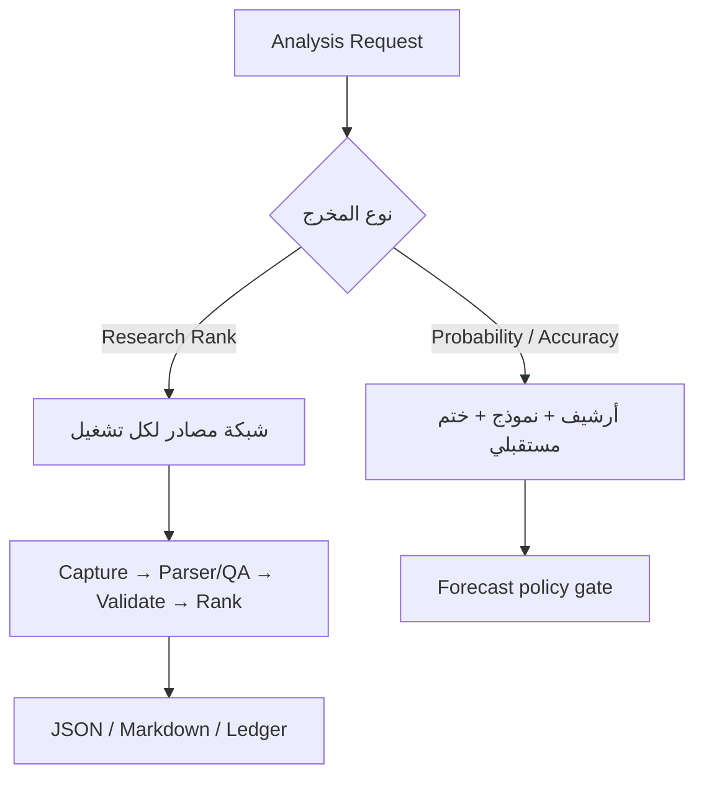

# معمارية الأساس البرمجي KU-BO 0.1.0

هذه المعمارية تصف أساسًا قابلًا للتدقيق واختبار العقود، لا منصة Production مكتملة أوخدمة بيانات حية مضمونة التوافر.

## المساران

`research_network` هو المسار الافتراضي. يعتمد على دليل حديث متعدد المصادر ويعمل من دون أرشيف كامل أو نموذج. `validated_forecast` هو مسار V2 الصارم؛ لا يسمح باحتمال أو ادعاء أداء إلا عند استيفاء Pack وModel Card والتحقق المستقبلي.

## مكونات مسار الشبكة

- `SourceNetworkCatalog`: يقرأ سجل المصادر وسياسات الأفق، ويتحقق من الأدوار والنطاقات والاستقلال وحدود التوقيت.
- `ingestion` و`capture_plan`: يجمعان البايتات العامة أوUser exports بصورة محدودة، ويحفظان Raw وManifest دون ترقيتها تلقائيًا إلى Finding.
- `Parser/QA`: حد عقدي مطلوب بين الجمع والتحقق، لكنه ليس مجموعة Parsers حية خاصة بالمواقع في الإصدار `0.1.0`. أي Parser لاحق يجب أن ينتج `fact_type` وهوية وتوقيتًا قابلة للتحقق وأن يخضع لاختبار Drift.
- `SourceNetworkRunValidator`: يتحقق من عقد التشغيل، الأثر الخام، Manifest، محاولات المصادر، Findings، التوقيت، والـQuorum.
- `rank_research_candidates`: يجمع الإشارات بعد Dedup، ويطبق سقف ثقة فئة المصدر وسقف المزاج، ويرصد التعارض.
- `analysts` و`liquidity`: ينتجان إشارات وصفية شفافة ويقيسان Tradability؛ لا ينتجان Probability.
- `ResearchPipeline`: يحول نتيجة التحقق إلى `RESEARCH_READY` أو حالة توقف/نقص، ثم يعيد مرشحين بحدود الادعاء.
- `request_contracts` و`reporting`: يطابقان Scope ونوع التقرير واللغة والعمق، ويرفضان Claims غير مسموحة.
- `research_ledger`: يجمد Decision وOutcome في streamين منفصلين مع Hash chain وSeal.
- `cli_v3`: يوفر أوامر الجمع والتحقق والتخطيط والتقرير والسجل.

## استقلال المصادر

الاستقلال يُحسب حسب الناشر/الأصل، لا حسب الرابط. صفحات Boursa الحالية والتقارير والإفصاحات تنتمي إلى مجموعة واحدة. كذلك Investing وصفحات تعليقاته مجموعة واحدة، وTradingView وIdeas مجموعة واحدة. المقالات المنسوخة من Reuters تُجمع في أصل واحد. إعادة إرسال رسالة Telegram لا تنشئ مصدرًا ثانيًا.

لا يكفي أن يعلن المصدر أنه أدى دورًا. كل Finding يحمل `evidence_roles`، ويُحسب نصاب الدور لكل ورقة مالية من الناشرين والأصول والأحداث المستقلة المرتبطة فعليًا بهذه Findings. `ZERO_RESULT` لا يملأ Quorum، والنتائج المحايدة أوذات Strength/Materiality صفر لا ترفع Coverage. وعند تأكيد محفز، يجب أن يطابق المصدر الرسمي `event_key` والاتجاه نفسه.

## حدود الحقيقة

- الرسمي/جهة الإصدار: يستطيع تأكيد حدث أو هوية رسمية.
- Structured secondary: يستطيع إنشاء Observation منسوبًا للمزود، لا حقيقة رسمية.
- Editorial: يستطيع إنشاء سياق/خبر منسوبًا للمصدر، مع Dedup للأصل.
- Community: `SENTIMENT` و`RISK` فقط.
- Web archive: `ARCHIVE_CONTEXT` فقط.
- Search/Storage: لا ينشئ Finding.
- Licensed: يمكنه دعم Execution فقط مع Entitlement وتوقيت مثبتين.

## بوابات الفشل

أي Hash غير مطابق، أو Hash تابع لمصدر آخر، أو Artifact جُمع بعد القرار، أو مسار Raw غير آمن، أو مصدر غير مسجل، أو URL خارج النطاق، أو Finding مستقبلي، أو Search Snippet/Access Receipt مستخدم كدليل، أو محاولة ترقية المنتدى إلى Catalyst تجعل الحزمة `BLOCKED`.

نقص نصاب الأدوار يجعلها `PARTIAL`. تعطل مصدر منفرد لا يوقفها إذا اكتمل النصاب من مجموعات مستقلة أخرى.

الـRanker لا يستطيع إزالة Blocking Error، ولا يستطيع توليد Probability أو Recommendation.
